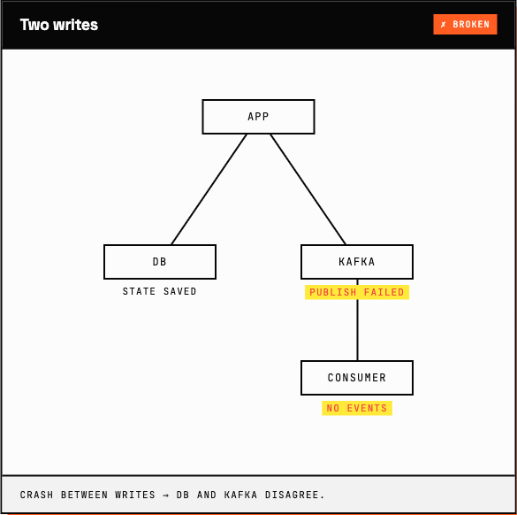
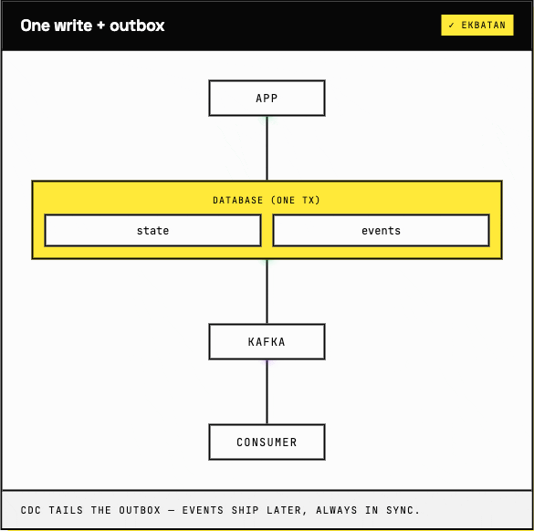

<!--
Medium-publication-ready article.

For publication:
  - Paste from "# Ekbatan, ..." to the end into Medium's article body.
  - Cut the "# Title" line into Medium's title field above the article body.
  - The two image references below point to ../article-assets/gifs/. Medium
    will not render local paths, so when pasting:
       (a) drag-and-drop the GIFs from docs/article-assets/gifs/ into the
           editor at each image spot, then delete the broken-image marker, or
       (b) replace the relative paths with public GitHub raw URLs once the
           GIFs are committed to main.
-->

# Ekbatan, an event-driven persistence framework for Java services on Spring, Quarkus, and Micronaut

Here is the bug. A customer deposits money into their account. The service inserts a row into the database in a transaction, commits, and then publishes a `WalletMoneyDepositedEvent` to Kafka so the notification service can send the SMS, the ledger service can update its books, and the audit pipeline can record the event. The publish call fails. The broker was down for two seconds. The network blipped. The transaction is already committed, the row is in the database, and the event never reaches the broker. The customer sees the new balance, the notification never arrives, the ledger drifts. Nobody notices for a week.

The reverse version of the bug exists too. Some implementations publish the event first and then commit. The publish succeeds. The commit fails. Downstream consumers now act on a deposit that never happened. The compensating logic written to clean up after this is its own category of code, much of it more complicated than the original deposit.

This is the dual-write problem. Two writes (database, broker), two systems, no shared transaction. It is one of the oldest and most discussed problems in distributed-systems literature (Confluent, microservices.io, Fowler, every event-driven architecture book of the last decade), and the canonical fix is well understood. It is called the transactional outbox.



The pattern is small. Stop writing to the broker inside the service request. Write the row and the event into the same database, in the same transaction. Use a second process to drain the event rows out to the broker. Kafka is the canonical target. Pulsar, RabbitMQ, NATS, Kinesis, Pub/Sub all fit the same shape, because the pattern requires nothing more than a tailable outbox table and a process that delivers from it. If the publish fails, the event sits in the outbox and gets retried until it lands. If the transaction rolls back, the event rolls back with it. State and events never diverge because they were never separated in the first place.



Implementing the outbox pattern by hand is more code than the pattern suggests. You need an outbox table and an insert into it on every business transaction. None of it is hard. It is just the kind of code that gets rewritten in every project and that occasionally hides a silent bug nobody catches in code review.

Ekbatan is a Java persistence framework that turns the outbox pattern into the default shape of persistence. The way it does that rests on three concepts: the **Model**, the **Action**, and the **ActionExecutor**. Each layer plays a specific role. Once you see how they fit together, the dual-write bug becomes a thing your code cannot accidentally write.

**The Model.**

A Model is your domain object. `Wallet` is one. `Order`, `Account`, anything that holds state and emits events when that state changes.

```java
@AutoBuilder
public final class Wallet extends Model<Wallet, ...> {
  public final BigDecimal balance;
  public final Currency currency;
  // ...
}
```

The fields are `final`. The class is `final`. Instances cannot be modified in place. A change to a wallet does not mutate the object you are holding, it produces a new object that reflects the new state. This is the same pattern as `BigDecimal` or `LocalDate` in the JDK. `BigDecimal.add(...)` does not modify the original, it returns a new `BigDecimal`. Models work the same way.

**Changes are methods on the model.**

You cannot write `wallet.balance = balance.add(amount)`. The field is final, the compiler rejects it. Instead the wallet exposes a method for each kind of change it supports.

```java
public Wallet deposit(BigDecimal amount) {
  return copy()
      .withEvent(new WalletMoneyDepositedEvent(id, amount))
      .balance(balance.add(amount))
      .build();
}
```

Reading the body top to bottom:

- `copy()` starts from the current Wallet and gives you a builder seeded with all of its fields.
- `withEvent(...)` attaches the event that describes the change. It does not publish anywhere. The event is recorded on the builder.
- `balance(...)` sets the new balance.
- `build()` produces the new Wallet.

The caller receives the new Wallet. The new Wallet carries the event with it. The old Wallet is unchanged.

**Whether a change attaches an event is up to you.**

A real wallet has more than one operation. Most follow the same shape: copy, attach an event, set the new state, build.

```java
public Wallet deposit(BigDecimal amount) {
  return copy()
      .withEvent(new WalletMoneyDepositedEvent(id, amount))
      .balance(balance.add(amount))
      .build();
}

public Wallet spend(BigDecimal amount) {
  return copy()
      .withEvent(new WalletMoneySpentEvent(id, amount))
      .balance(balance.subtract(amount))
      .build();
}

public Wallet freeze(String reason) {
  return copy()
      .withEvent(new WalletFrozenEvent(id, reason))
      .status(Status.FROZEN)
      .build();
}

public Wallet markLedgerReconciled(Instant at) {
  return copy()
      .lastReconciledAt(at)
      .build();
}
```

Three of these methods attach an event. `markLedgerReconciled` does not, because the timestamp it updates is internal and nothing downstream needs to see it. Add `.withEvent(...)` when the change should be observable, leave it off when it should not. Both the new state and the event come from the same builder expression.

So far, nothing has touched the database. Everything is in memory. You have a new `Wallet` object holding the new state, and zero or one event recorded on it, waiting to become durable. That is what an Action does.

**The Action.**

An Action is the unit of business work. It reads from a repository, calls a change method on the model, and stages the new version for persistence. It does not open a transaction. It does not write to the database directly. It describes the change and hands it off.

The hand-off is the plan: a record of what should be persisted (additions and updates). The `ActionExecutor` picks up the plan after `perform()` returns and applies it inside one database transaction, writing the staged state and any attached events together.

```java
@EkbatanAction
public class WalletDepositAction extends Action<Params, Wallet> {

  protected Wallet perform(Principal p, Params params) {
    var wallet = walletRepository.getById(params.walletId());
    var updated = wallet.deposit(params.amount());
    return plan().update(updated);
  }
}
```

Line by line:

- `walletRepository.getById(...)` reads the current wallet from the database.
- `wallet.deposit(...)` returns a new Wallet with the new balance and a `WalletMoneyDepositedEvent` attached.
- `plan().update(updated)` stages the change. The plan is the action's record of what should be persisted. `update(...)` means "this entity already exists, persist its new version." The plan also exposes `add(...)` for new entities.

When `perform()` returns, nothing has been written. The plan holds the staged change. The mutated wallet carries the event. Both are still in memory.

**The Executor commits everything together.**

`ActionExecutor` is what your REST controller, job worker, scheduled task, or CLI command injects. It runs the action, takes the plan after `perform()` returns, and does the persistence work in one database transaction.

Here is the Spring REST controller that exposes the deposit endpoint. It injects `ActionExecutor` through its constructor and calls `execute(...)` with a principal supplier, the action class, and the params object the action expects.

```java
@RestController
@RequestMapping("/wallets")
public class WalletController {

  private final ActionExecutor executor;

  public WalletController(ActionExecutor executor) {
    this.executor = executor;
  }

  @PostMapping("/{id}/deposit")
  public Wallet deposit(@PathVariable UUID id,
                        @RequestBody Body body) throws Exception {
    return executor.execute(
        () -> "rest-user",
        WalletDepositAction.class,
        new Params(Id.of(Wallet.class, id), body.amount()));
  }
}
```

What the executor does inside that one transaction:

```
BEGIN
  UPDATE wallets SET balance = ..., currency = ...
                 WHERE id = ...
  INSERT INTO events (event_id, type, payload, occurred_at, ...)
                 VALUES (..., 'WalletMoneyDepositedEvent', ..., ..., ...)
COMMIT
```

The wallet row and the event row land in the database together. If either write fails, the whole transaction rolls back. Neither the new balance nor the event is durable. There is no window where the state has changed and the event is missing, because the event was never separated from the state to begin with.

This is the property the framework is built around. The Model couples state and event in the same builder. The Action stages them together. The Executor commits them in the same transaction. Three layers cooperate so that "the database has the change, the broker does not" is a state your code cannot accidentally produce.

A consumer downstream of the outbox table, reading through Debezium or any other CDC tool, sees events only for state changes that actually committed. Whatever the broker eventually receives matches what is in the database. The dual-write bug is gone, not because the framework retries harder, but because the second write never existed.

**Repositories.**

Repositories are thin subclasses of `ModelRepository`. They inherit `getById`, `add`, and `update`. Custom queries are written in the typed jOOQ DSL when you need them. There is no Hibernate session, no lazy loading, no dirty checking, no JPA annotations soup. The persistence layer is jOOQ end to end, which keeps SQL close to the surface and query performance predictable. The cost is that you write queries explicitly rather than describing them with annotations. In practice that is a feature, because the queries that hurt you in production are the ones the framework wrote for you without your knowing what they did.

```java
@EkbatanRepository
public class WalletRepository extends ModelRepository<Wallet, ...> {

  public List<Wallet> findAllByOwnerId(UUID ownerId) {
    return readonlyDb()
        .selectFrom(WALLETS)
        .where(WALLETS.OWNER_ID.eq(ownerId))
        .fetch(this::fromRecord);
  }
}
```

**Running on Spring, Quarkus, Micronaut.**

The framework runs on Spring Boot, Quarkus, and Micronaut. The persistence model is the same across all three. Only the DI wiring differs, and that is wired for you per stack. The example projects cover every combination of those three DIs against Postgres, MariaDB, and MySQL, in both Maven and Gradle, with and without GraalVM native compilation. If your service already runs on one of these stacks, integrating Ekbatan is a dependency and a small block of configuration. There is no separate runtime to operate.

**Sharding.**

Sharding is built in. The framework supports horizontal partitioning across multiple databases, with a `ShardIdentifier` value identifying which shard a row belongs to. Reads and writes route to the correct database based on configuration. The outbox semantics carry across shards because each shard writes its own outbox, which a CDC consumer can tail independently.

**What Ekbatan does not solve.**

The drainer and the publish step itself. The framework writes events into the outbox and stops there. Delivery to the broker is whatever pipeline you prefer: Debezium tailing the outbox is the canonical choice and the one used in the example projects, a polling job is a fine alternative for smaller deployments, a scheduled task works if you do not need low latency. Ekbatan stays out of that decision so you can match the drainer to the operational model you already have. Ordering, idempotency, and consumer-side processing remain the consumer's responsibility, the same way they would be in any event-driven architecture. Ekbatan removes the dual-write bug from your service. It does not remove distributed-systems thinking from your architecture.

It also does not try to be a CQRS framework, a saga orchestrator, an event store with replay, or a workflow engine. It is a persistence layer with a hard guarantee about how state and events are written. Everything downstream of the outbox stays as flexible as your stack was already.

**Where to read next.**

The code is at [github.com/zyraz-io/ekbatan](https://github.com/zyraz-io/ekbatan). For most readers, the better place to start is the website at [zyraz-io.github.io/ekbatan](https://zyraz-io.github.io/ekbatan/). It has the concepts written out in full, a getting-started tutorial with a stack picker that gives matching snippets for Spring, Quarkus, or Micronaut on Gradle or Maven, runnable examples for every combination of framework and database, and the API reference. Apache 2.0.
